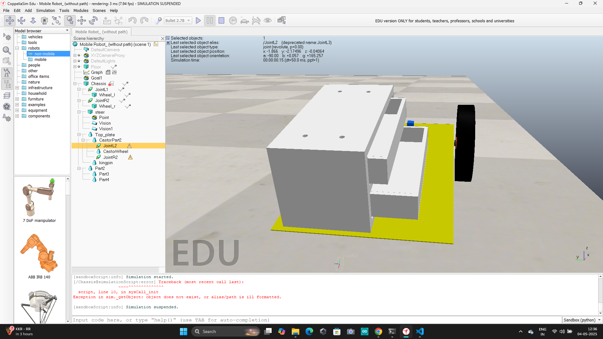
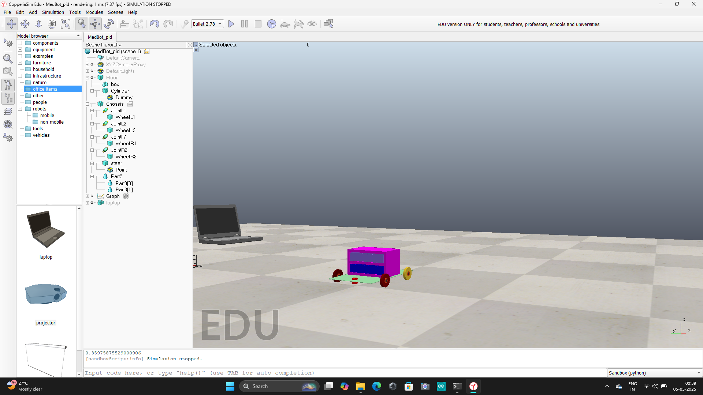
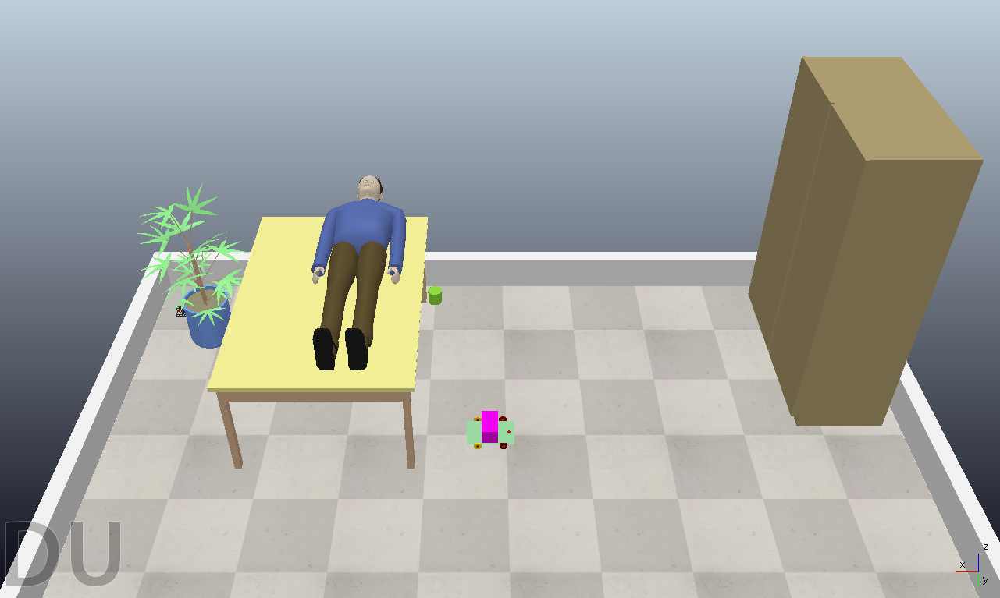
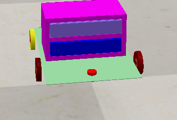
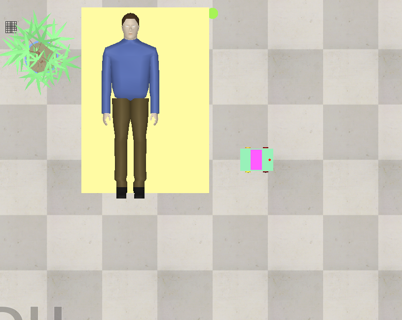

# MEDBOT_WITH_PID_CONTRO
MEDBOT Project is a healthcare service robot simulated in CoppeliaSim that functions as an autonomous medical kit delivery bot. The robot is equipped with PID-based motion control to ensure accurate and stable navigation within the simulation environment.

## 📸 Demo

## 1: 

## 2: 

## 3: 

## 4: 

## 5: 

